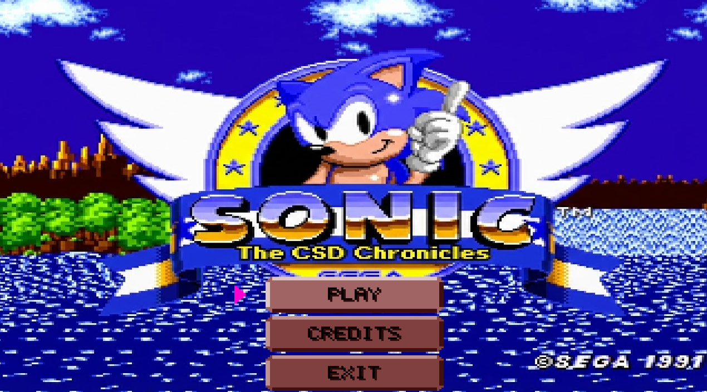
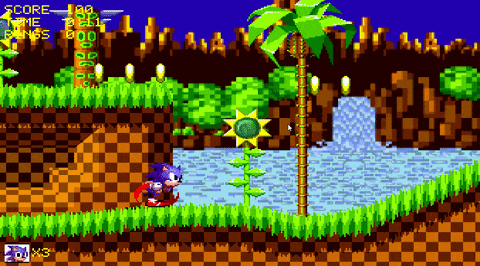
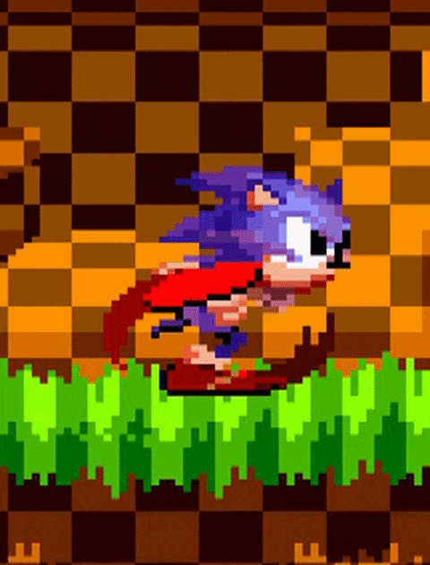
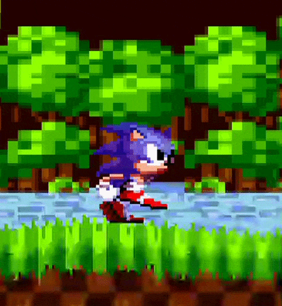
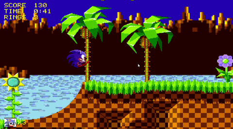

# Sonic The Hedgehog

<p align="center">
  
</p>

<p align="center">
  A C++20 / SDL3 fan project that recreates a Green Hill-style Sonic level with custom rendering,
  sprite animation, collision, movement physics, sound, menus, and gameplay systems.
</p>

## Preview

| Gameplay | Running | Walking | Slopes and damage |
| --- | --- | --- | --- |
|  |  |  |  |

## Features

- Classic Sonic-inspired side-scrolling gameplay at a Sega Genesis-style 320x224 viewport.
- Smooth camera tracking over a 10240x1536 level.
- Tile-based level rendering with parallax background scrolling.
- Pixel-precise grid collision with slope handling and ramp launch behavior.
- Sonic movement states for idle, walking, running, jumping/ball form, tunnels, and damage recovery.
- Collectible rings, scattered ring loss on hit, checkpoints, lives, score, timer, and HUD.
- Enemies, enemy projectiles, bridges, flowers, goal ring, pause menu, credits, and ending flow.
- Custom engine modules for rendering, animation, physics, input, events, scene management, and sound.
- Data-driven assets through JSON film definitions and terrain/ring/flower data files.

## Controls

| Action | Keys |
| --- | --- |
| Move Sonic | `A` / `D` or `Left` / `Right` |
| Jump | `W` or `Space` |
| Menu navigation | `W` / `S` or `Up` / `Down` |
| Select menu item | `Enter` or `Space` |
| Pause / resume | `Escape` |
| Toggle collision grid overlay | `G` |
| Return from credits | `Escape` |

## Project Layout

```text
Application/
  Assets/          Game textures, sounds, terrain, and JSON data
  Game/            HUD and game-stat tracking
  Scenes/          Menu, gameplay, credits, and scene manager
  Sprites/         Sonic, enemies, rings, checkpoints, bridge, and props
  Utilities/       Drawing helpers, film parsing, movement utilities

Engine/
  Animations/      Animation films, animators, scrolling, paths, tunnels
  Core/            Game loop, context, events, clock, input, destruction
  IO/              SDL input mapping
  Physics/         Bounding areas and collision checking
  Rendering/       Bitmap, color, clipping, renderer, stb_image integration
  Scene/           Sprites, tile layers, grid map, gravity, motion quantization
  Sound/           SDL_mixer-backed sound and music helpers

Import/            CPM dependency declarations
Misc/              README logo and gameplay captures
LICENSES/          Project and third-party license files
```

## Requirements

- CMake 3.20 or newer.
- A C++20 compiler (MSVC on windows or Clang on Mac/Unix).

## Build and Run

From the repository root:

```sh
cmake -S . -B build
cmake --build build --config Release
```

For Visual Studio project generation:

```sh
cmake -S . -B proj/ -G "Visual Studio 18 2026"
```

For Xcode project generation:

```sh
cmake -S . -B proj/ -G "Xcode"
```

The binary will be located under

```sh
<proj or build>/bin/<Debug or Release>/Application
```

### Note for case-sensitive filesystems

The top-level CMake file in this repository is currently named `CMakeLIsts.txt` rather than
`CMakeLists.txt`. Windows usually resolves this because its filesystem is case-insensitive by default,
but Linux/macOS case-sensitive setups may require renaming it before configuring with CMake.

## Assets and Data

Runtime assets live under `Application/Assets`:

- `Textures/` contains sprite sheets, level tiles, menu art, and backgrounds.
- `Sounds/` contains music and sound effects.
- `Terrain/` contains CSV and compressed grid terrain data.
- `Data/` contains JSON definitions for animation films, rings, and flowers.

The executable receives the asset directory at compile time through the `ASSETS` definition in
`Application/CMakeLists.txt`, so the game can load assets using absolute paths produced by CMake.

## License

Project code is licensed under the MIT License. See `LICENSES/SonicTheHedgehog`.

Third-party licenses are collected in `LICENSES/`. Sonic-related names, characters, music, and artwork
belong to their respective owners; this repository is a fan/educational project.
